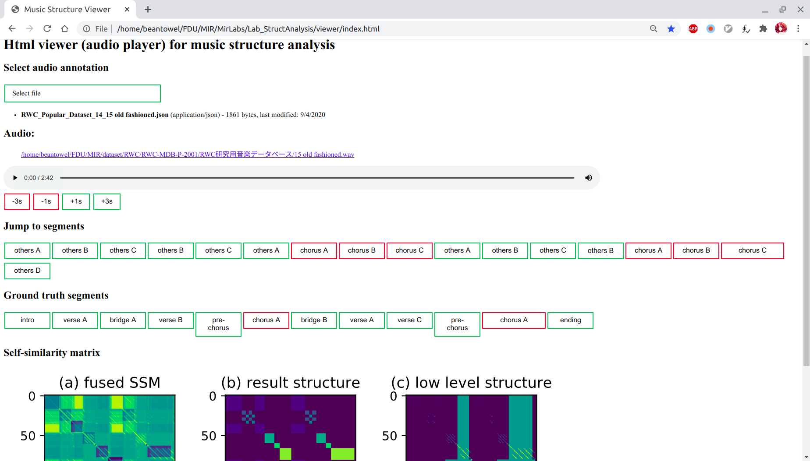

# Chorus Detection Using Music Structure Analysis

This repo implements the paper [Chorus Detection Using Music Structure Analysis](https://null). The algorithm detects chorus sections in pop music, and the output follows the [MIREX (*Music Information Retrieval Evaluation eXchange*) Structural Segmentation](https://www.music-ir.org/mirex/wiki/2017:Structural_Segmentation) format. The code also evaluated some other algorithms:

- [pop-music-highlighter](https://github.com/remyhuang/pop-music-highlighter)

- 5 algorithms in [msaf](https://github.com/urinieto/msaf)

## Prerequisite

The algorithm was implemented in `Python 3.7`, the requirements were listed in `requirements.txt`, install them using:

```bash
pip install -r ./requirements.txt
```

The **latest** version of `librosa` which has some crucial fixes should be installed via github:

```bash
git clone --depth=1 https://github.com/librosa/librosa.git
pip install -e librosa
```

Download the melody extraction algorithm [JDC](https://github.com/keums/melodyExtraction_JDC):

```bash
git clone --depth=1 https://github.com/keums/melodyExtraction_JDC.git
```

## Configuration

A few paths need to be set in `configs/configs.py`:

- the code depends on the algorithm [JDC](https://github.com/keums/melodyExtraction_JDC) mentioned above, edit the value `ALGO_BASE_DIRS['JDC']` so that it points to the location of the downloaded repo.

- the preprocessed data were stored in `DATASET_BASE_DIRS['LocalTemporary_Dataset']`, change it to anywhere you want to store the large files.

If you are only interested in using the algorithm, you can skip the following lines.

If you want to evaluate the algorithms, more configurations need to be done:

- the code evaluates the algorithms on the [RWC Pop dataset](https://archives.ismir.net/ismir2002/paper/000049.pdf), if you have the dataset and want to evaluate on it, edit the value `DATASET_BASE_DIRS['RWC']` so that it points to the location of the dataset, and ensure the directory structure is as listed below:

    ```bash
    .
    └── RWC-MDB-P-2001
       ├── AIST.RWC-MDB-P-2001.CHORUS
       ├── RWC研究用音楽データベース
       ├── RWC研究用音楽データベース Disc 2
       ├── RWC研究用音楽データベース Disc 3
       ├── RWC研究用音楽データベース Disc 4
       ├── RWC研究用音楽データベース Disc 5
       ├── RWC研究用音楽データベース Disc 6
       └── RWC研究用音楽データベース Disc 7
    ```

- for evaluation of the algorithms implemented by [msaf](https://github.com/urinieto/msaf) python package, comment out the line 335 `file_struct.features_file = msaf.config.features_tmp_file` in `.../lib/python3.7/site-packages/msaf/run.py` and `mkdir features` in the dataset folder for faster performance using feature cache instead of single temporary feature file.

- for evaluation of the [pop-music-highlighter](https://github.com/remyhuang/pop-music-highlighter), since the python version is not compatible with that of the highlighter, you need to get its result in advance and set the value of `ALGO_BASE_DIRS['PopMusicHighlighter']` so that it points to the location containing the results as `<originalAudioFileName>_highlight.npy` files.

## Usage

To detect the chorus sections of a music recording, use the `predict.py`:

```bash
Usage: predict.py [OPTIONS] AUDIOFILE [OUTPUTDIR] [METAOUTPUTDIR]

Options:
  --algo [multi|single]
  --help                 Show this message and exit.

```

A Quick example is

```bash
python predict.py $(pwd)/data/example/starfall.mp3
```

By default, the algorithm outputs all the chorus sections detected, but you can use the option `--algo single` to force it outputs single chorus section.

The default directory for mirex format output (OUTPUTDIR) is `./data/predict`, the output file contains 3 columns:

```
<onset_time(sec)>\t<offset_time(sec)>\t<label>\n
<onset_time(sec)>\t<offset_time(sec)>\t<label>\n
...
```

The default directory for viewer metadata (METAOUTPUTDIR) is `./data/viewerMetadata`, the json files were used for a simple html player which shows the result of chorus detection. To view the output and play the music, use the simple html [page](viewer/index.html) `./viewer/index.html` to open the metadata file.

The metadata generated by the algorithm always links to a local audio file. For a quick example however, you can open the [file](data/example/starfall_meta.json) `data/example/starfall_meta.json` which has a online audio link in the viewer:



To evaluate the algorithms, calculate the features for audio files first, then evaluate:
```bash
python feature.py && python evalAlgos.py
```